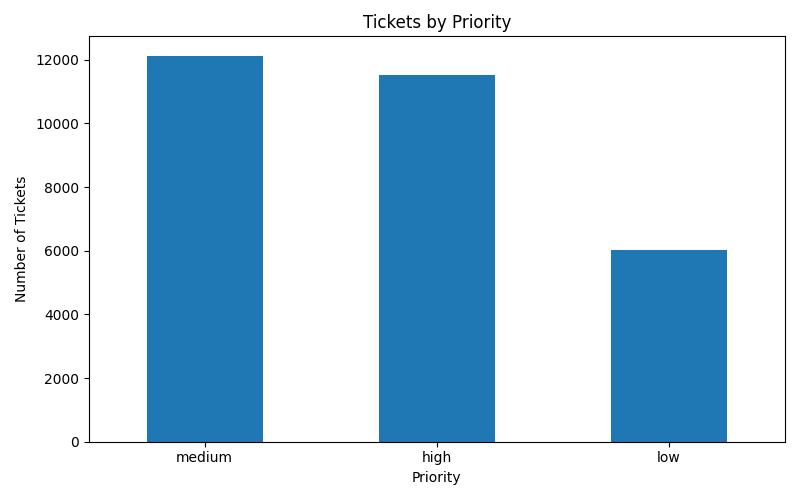
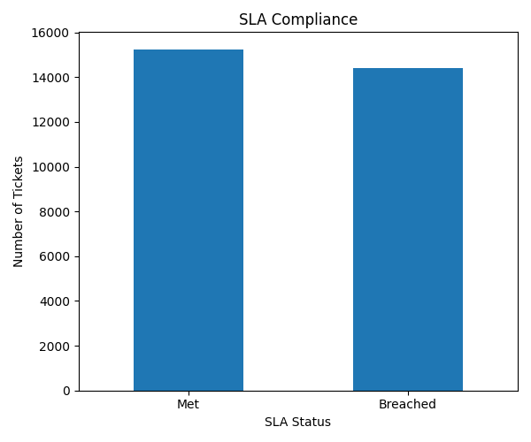

# IT-Service-Desk-Dashboard
This project analyzes IT helpdesk ticket data to monitor service performance, identify trends and track SLA compliance. The dashboard automates reporting and provides insights to support IT decisions 
## Tools and Technologies  
-Python  
-Pandas  
-Matplotlib 
---
## Key Metrics  
-Total IT support tickets  
-Average Resolution Time (MTTR)  
-SLA Compliance %  
-Ticket distribution by top tags, priority and department  
-Monthly Resolution Trend
---
## Dashboard Visualizations 
### Tickets by Top_Tags
  
### Tickets by Priority  
  
### Tickets by Department  
  
### SLA Status  
  
### Resolution Time Trend  

---
## Project Workflow  
1. Generated simulated IT service desk dataset
2. Cleaned and transformed data using Python
3. Calculated SLA compliance and resolution metrics
4. Automated dashboard chart generation
---
## How to Run the Project  
-Run data_cleaning.py and dashboard.py scripts
---
## Business Value  
-Monitor support performance  
-Detect service bottlenecks  
-Improve SLA compliance  
-Enable data-driven decision making 
---
## AUTHOR  
SHREYA THANIPARTHI

